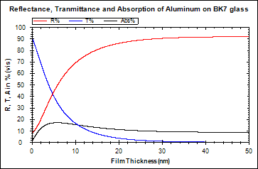

# Напыление тонких плёнок в вакууме
**Шмаков Владимир Б04-105**

## Цель работы
- Познакомиться с методами термовакуумного напыления плёнок.
- Получить плёнку аллюминия некоторой толщины, используя термовакуумное испарение.
## Оборудование
- Испаритель
	- Мощный блок питания
	- Проволока(в нашем случае из вольфрама)
	- Металлические контакты
- Вакуумная камера
	- Колпак
	- Прорезиненная подложка(для устранения течей вследствие плохого контакта поверхности с колпаком)
	- Насос для предварительной откачки
	- Формвакуумный насос
- Расходные материалы
	- Проволока из аллюминия
	- Стекло
- Измерительные приборы
	- линейка
	- вакуометр
- Прочее
	- Стойка с <<лапкой>> для удерживания стеклышка
	- Кусачки
## Теоретические данные
Существует несколько методов напыления тонких пленок. Кратко ознакомимся с каждым из них

#### Термическое испарение
Суть метода заключается в следующем. Необходимо расположить область для напыления в вакуумной камере, затем испарить металл. Таким образом, пары напыляемого материала(металла) осядут(сконденсируются) на необходимой области.

Тут может возникнуть вопрос:
> Почему нанесение стоит проводить в вакууме? И из каких соображений стоит подбирать параметры используемого вакуума?

Представим, что напыление происходит вне вакуумной камеры. Тогда молекулы напыляемого материала испытают множество столкновений, перед тем как попасть на объект напыления. Вследствие этого плёнка получится неравномерной, и большинство напыляемого материала будет истарчено впустую(попросту не попадёт на объект напыления).
Необходимый вакуум следует подбирать так, чтобы длина свободного пробега остаточных газов была много больше, чем расстояние от испарителя, до объекта напыления: $R<<\lambda$ .

Помимо характеристик вакуума, стоит учитывать и скорость испарения напыляемого материала. При быстром испарении, молекулы напыляемого газа объеденяются в островки, вследствие чего пленка получается неравномерной. При медленном, плёнка получается <<грязной>> из-за воздействия внешних параметров(столкновения с молекулами остаточного газа).

## Экспериментальная установка

![[установка для напыления плёнок]]

Установка схематично изображена на рисунке. Попробуем рассчитать зависимость толщины пленки от расстояния между испариетелем и напыляемой поферхностью
![[распределение толщины]]
Согласно термодинамике о единицу площади в единицу времени бьётся $N = n \frac{V_{a}}{4}$ молекул. 
Выразим концентрацию и скорость из известных соотношений для идеального газа:$$N = \frac{P}{kT} \cdot \sqrt{\frac{8kT}{\pi m}} \cdot \frac{1}{4}$$
Считаем распределение молекул изотропным(молекулы с равной вероятностью летят в различных направлениях). Тогда вероятность того, что молекула полетит в направлении вектора $R_{0}$ есть $h \cdot dx / (4\pi R_{0}^{2})$ - где $h$ - высота поверхности напыления. Таким образом:$$N_{0} = \frac{h \cdot dx}{4\pi R_{0}^{2}} \cdot N$$
По окончании эксперимента вся масса $m$ аллюминия испарится -> толщина плёнки составит:
$$t_{0} = \frac{m}{4\pi \rho R_{0}^2}$$
В описании к работе присутствует вывод формулы для распределния $t$ по поверхности напыляемого материала:
$$t = \frac{mR_{0}}{4\pi \rho R^{3}}$$
## Обработка результатов 

Рассчитаем $t_{0}$ и оценим погрешность. Используя метод частных производных:
$$\Delta t_{0} = |\operatorname{grad}t_{0} \cdot \Delta_{t_{0}}|_{2}=\sqrt{\frac{\left|{\frac{\Delta_{m}}{R^{2} \rho}}\right|^{2}}{16 \pi^{2}} + \frac{\left|{\frac{\Delta_{R} m}{R^{3} \rho}}\right|^{2}}{4 \pi^{2}} + \frac{\left|{\frac{\Delta_{\rho} m}{R^{2} \rho^{2}}}\right|^{2}}{16 \pi^{2}}}
$$
> здесь точкой обозначено **поэлементное** умножение векторов. Вектор $\Delta_{t_0}$ состоит из погрешностей параемтров, от которых зависит $t_0$: $\Delta_{t_0} = |\Delta_{m}, \Delta_{R_0}, \Delta_{\rho}|^{T}$

Подставив данные эксперимента получаем:
$$t_{0} = 13 \pm 1 \ \text{нМ}$$
Теперь оценим толщину, используя данные спектрометра:

![[lightSpectr.png]]

> спектр освещения лампчки

![[materialSpectr.png]]

> спектр при просвечивании лампочки через стекло, с нанесённым аллюминиевым покрытием

Проинтегрируем данные функции, чтобы получить полный поток: $$\Phi = \int_{200}^{1000} \Phi(\lambda) d \lambda$$
Коэффициент пропускания определяется как отношения потока, пропущенного через материал, к потоку, падающему на материал:
$$T = \frac{\Phi}{\Phi_{0}}$$
В результате вычисления $T$ различными способами получаем $T = 22 \%$. Согласно [графику](https://commons.wikimedia.org/wiki/File:Aluminum_on_BK7_RTA_for_Wikipedia.png)

Толщина плёнки аллюминия при таком коэффициенте пропускания есть $10 \ \text{нМ}$. 

Согласно рассчётам, сделанным ранее получили, что максимальная толщина плёнки $t_0 = 13 \pm 1 \ \text{нМ}$. Воспользуемся формулой распределения толщины, и получим, что минимальная толщина есть $t_{min} = 10.5 \pm 0.8 \ \text{нМ}$. 

## Вывод

В результате экспериимента удалось получить тонкую пленку. Использовался метод термического испарения материала(в качестве испаряемого материала использовали аллюминий)

Теоретическая модель распределения толщины плёнки по поверхности материала напыления позволяет определеить конечную толщину плёнки в зависимости от начальных параметров.

Данная модель подтверждена экспериментально - теоретический результат $t_{min}$ в пределах погрешности совпал с практическим результатом(полученным с использованием спектрографа).